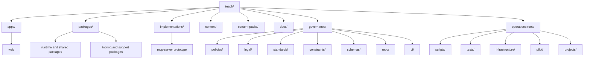
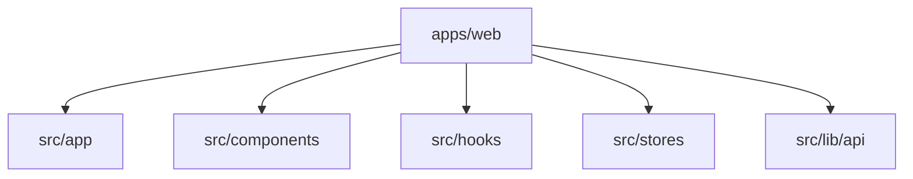
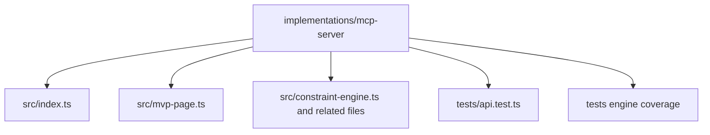
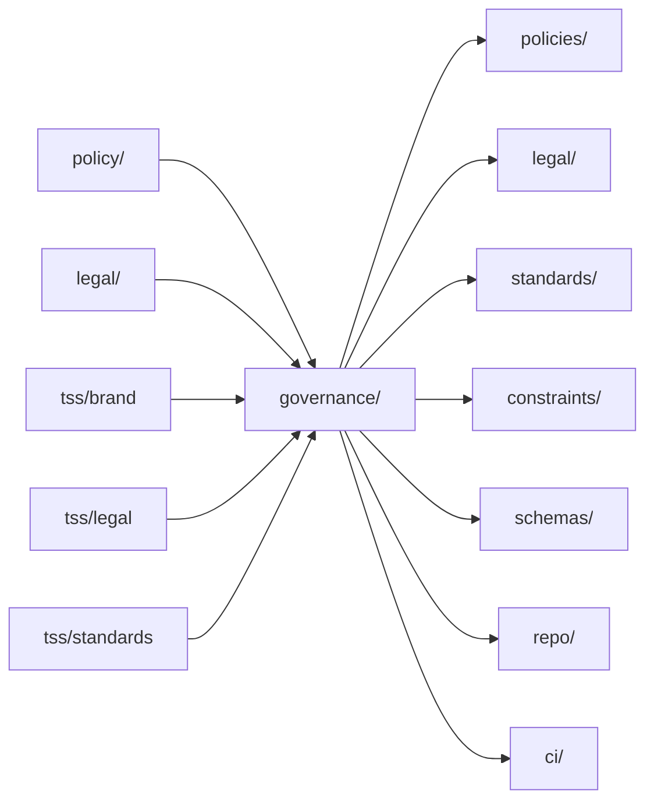
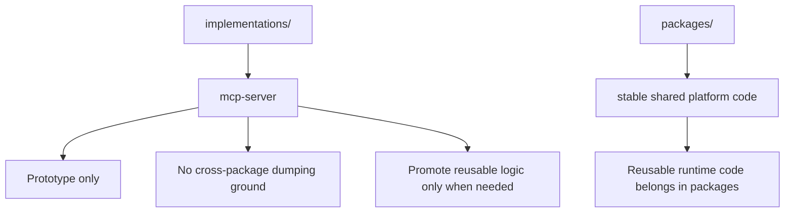
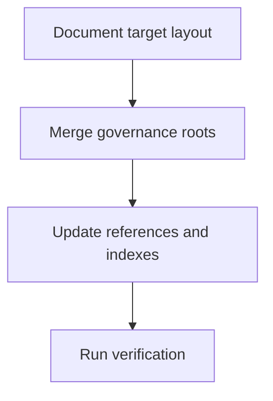

# Workspace Index

This index groups the repository by responsibility so files are easier to locate and browse.

## Topology

## Product Surfaces

- [../apps/README.md](../apps/README.md) for user-facing applications.
- [../apps/web](../apps/web) for the current web app.

## Application Map

## Reusable Packages

- [../packages/README.md](../packages/README.md) for package-level entry points.
- [../packages/api-server](../packages/api-server) for the main platform API server.
- [../packages/shared](../packages/shared) for shared types, schemas, and constants.
- [../packages/tests](../packages/tests) for shared test assets and parity coverage.

## Package Catalog

- `api-server`: platform API routes and middleware.
- `auth`: authentication logic and auth-facing helpers.
- `billing`: billing domain logic.
- `cli`: workspace command-line tooling.
- `config`: shared configuration exports.
- `content-authoring`: content creation and validation pipelines.
- `database`: database layer and persistence utilities.
- `email`: email-related platform code.
- `engine`: teaching or evaluation runtime logic.
- `governance`: package-scoped governance code.
- `observability`: logging, tracing, and operational instrumentation.
- `retrieval`: retrieval and search-related platform capabilities.
- `shared`: shared types, schemas, constants, and utilities.
- `testkit`: reusable test helpers.
- `tests`: package-scoped parity or shared test assets.
- `ui`: reusable interface primitives.
- `_future`: incubating package work not yet active.

## Prototypes And Implementations

- [../implementations/README.md](../implementations/README.md) for implementation-specific entry points.
- [../implementations/mcp-server](../implementations/mcp-server) for the MCP MVP server and manual click-through page.

## Implementation Map

## Teaching Content

- [../content/README.md](../content/README.md) for authored content.
- [../content/web-fundamentals](../content/web-fundamentals) for the example content domain.
- [../content-packs/README.md](../content-packs/README.md) for pack manifests and templates.

## Documentation And Governance

- [README.md](README.md) for the documentation sequence.
- [../governance/README.md](../governance/README.md) for the merged governance root.
- [../governance/policies/README.md](../governance/policies/README.md) for policy configuration and policy documents.
- [../governance/legal/README.md](../governance/legal/README.md) for privacy, terms, and legal texts.
- [../governance/standards/README.md](../governance/standards/README.md) for brand and organizational standards.

## Governance Model

## Prototype Boundary

## Placement Rules

- Put user-facing applications in `apps/`.
- Put reusable runtime and support code in `packages/`.
- Keep experiments and MVPs in `implementations/`.
- Keep authored learning material in `content/`.
- Keep pack manifests and distribution definitions in `content-packs/`.
- Keep policy, legal, brand, standards, repo controls, and CI governance in `governance/`.
- Keep setup and deployment tooling in `scripts/` and `infrastructure/`.
- Keep cross-package validation in `tests/`.

## Refactor Phases

## Operations And Validation

- [../scripts/README.md](../scripts/README.md) for automation entry points.
- [../tests/README.md](../tests/README.md) for repo-level test groupings.
- [../infrastructure/README.md](../infrastructure/README.md) for deployment assets.
- [../pilot/README.md](../pilot/README.md) for pilot data and trial fixtures.

## Root Control Files

- [../package.json](../package.json) for workspace scripts.
- [../pnpm-workspace.yaml](../pnpm-workspace.yaml) for workspace package inclusion.
- [../turbo.json](../turbo.json) for task orchestration.
- [../tsconfig.json](../tsconfig.json) and [../tsconfig.base.json](../tsconfig.base.json) for TypeScript configuration.

## Search Guidance

- Start in `apps/` for UI behavior.
- Start in `packages/` for durable platform code.
- Start in `implementations/` for prototypes and MVPs.
- Start in `docs/` and `governance/` for non-runtime material.
