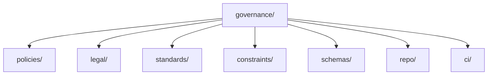

# Governance

This directory is the canonical home for policy, legal, standards, and repository governance artifacts.

## Areas

- `ci/` for CI-related governance.
- `constraints/` for enforceable constraints.
- `legal/` for privacy, terms, and other legal texts.
- `policies/` for policy configuration and governance policies.
- `repo/` for repository governance controls.
- `standards/` for brand and organization standards.
- `schemas/` for governance schemas.

## Structure

## Indexing Notes

- Start here for rules and control definitions rather than runtime code.
- This directory replaces the former top-level `policy/`, `legal/`, and `tss/` roots.

## Related Indexes

- [policies/README.md](policies/README.md)
- [legal/README.md](legal/README.md)
- [standards/README.md](standards/README.md)
